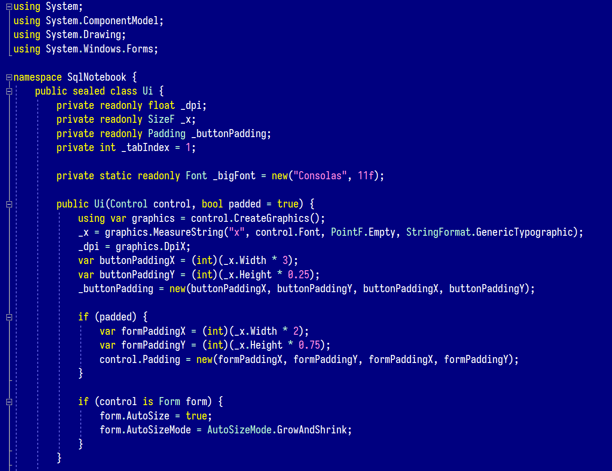

<h1 align="center">Commander Dark Theme for VS Code</h1>

## Installation

- Download the [`commander-dark-theme-0.0.1.vsix`](https://github.com/brianluft/commander-dark-theme/releases/tag/v0.0.1) file from the releases page.
- In VS Code, switch to the Extensions pane in the side bar.
- Click the "..." button and select "Install from VSIX..."
- Choose the downloaded `.vsix` file.
- File > Preferences > Color Theme > Commander Dark.
